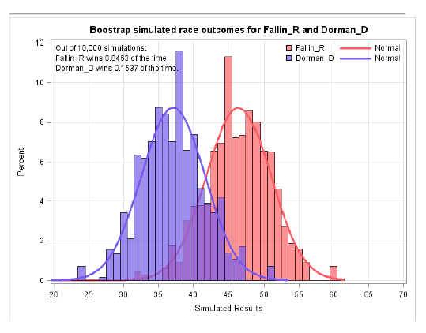
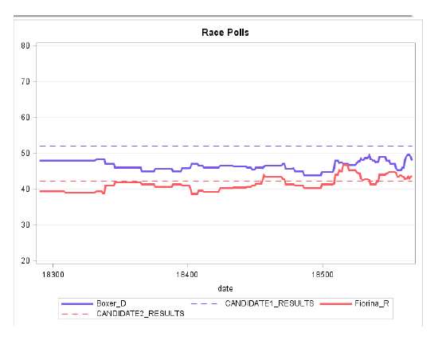
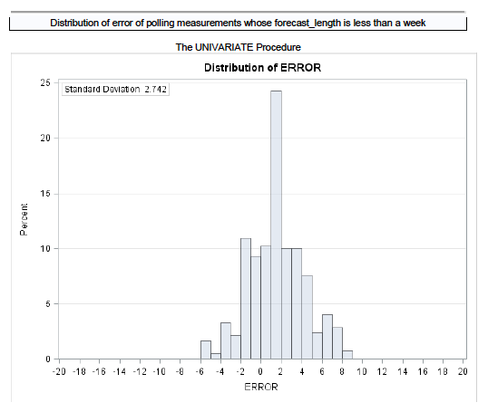
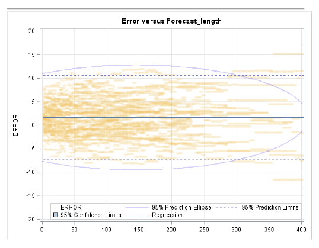
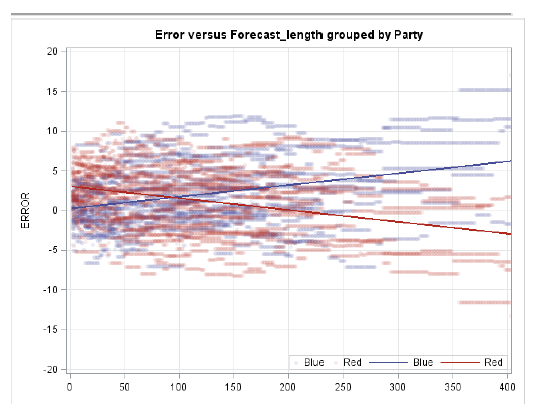

# Boot

Aims to extend deep web scraping capabilities to SAS 9.3 with a provided MAP file  
Demonstrates ability to perform scraped data analysis  
 
 
 
 
 
 
<b>Stable on SAS 9.3</b>
 
 
For SAS 9.4 the PC Files Server sometimes hangs when importing over a network drive if you do not have a recent version of Microsoft Access Database engine"   
Read more about this issue: 
http://www.umass.edu/statdata/software/sas/sas_install.pdf  
http://blogs.sas.com/content/sasdummy/2012/05/01/64-bit-gotchas/  
 
*Please note in order to run the code correctly you must specify the correct PATH to the XML Map file (currently in the code, it is set to "C:\Users\yourname\Desktop\RCP.map", you can search for this string in the code in order to replace with your own defined path)
